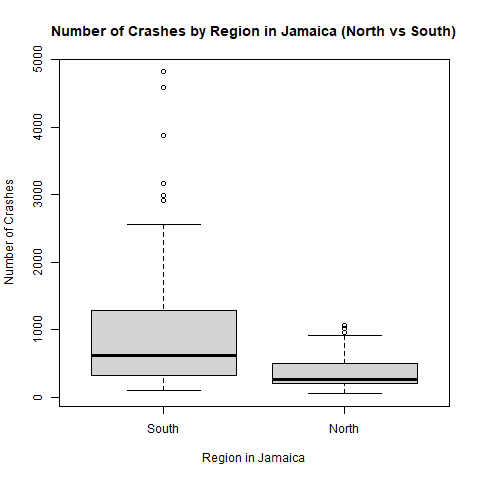

# Cover Page:
```
7COM1079-0901-2025 - Team Research and Development Project

Final report title: A Comparative Statistical Analysis of Road Traffic Crashes Between Northern and Southern Regions of Jamaica

Group ID: A100

Dataset number: DS 046

Prepared by: Farah Fazli – 45075452
             Yogisha Paneru – 23077080
             Chirag Menariya – 24155368
             Saurabh Yadav – 24057668
             Omowonuola Olajide – 24132488
```
---
# 1. Introduction

## 1.1.	Problem statement and research motivation

Road traffic crashes are a leading public health and development challenge in Jamaica, with hundreds of fatalities reported annually. This study asks whether towns and cities in Jamaica’s northern and southern regions differ in mean crash counts, aiming to reveal geographic disparities that current national summaries do not fully break down. Identifying regional differences can pinpoint high-risk areas and inform targeted infrastructure, enforcement, and education policies. Using island-wide crash records segmented by parish and town will allow robust statistical comparison and guide resource allocation to reduce injuries and fatalities across Jamaica’s varied transport routes. The analysis will support evidence-based policy decisions (Pan American Health Organization, 2024).

## 1.2.	The data set

The dataset contains yearly records of road traffic crashes across towns and cities in Jamaica, including variables such as Year, City, Number_of_Crashes, and Region_in_Jamaica (North, South, Unknown, External). It provides a detailed view of crash distribution between 2007 and 2015, allowing comparison of crash frequencies across regions. This structure enables statistical analysis, such as comparing mean crashes between northern and southern areas, to identify area-based patterns, assess regional risk, and guide targeted road-safety measures.

## 1.3.	Research question
Is there a difference in the mean of the crashes between towns /cities of the northern part & southern part of Jamaica?

## 1.4.	Null hypothesis and alternative hypothesis (H₀/H₁) 
For this study, the null hypothesis (H₀) states that there is no difference in the mean number of road traffic crashes between towns and cities in the northern and southern regions of Jamaica. In formal terms: 
```
H₀: µNorth = µSouth
```
The alternative hypothesis (H₁) proposes that there is a difference in the mean crash counts between the two regions, indicating possible regional variability: 
```
H₁: µNorth ≠ µSouth
```
These hypotheses directly address the research question by testing whether regional crash patterns differ significantly.

---

# 2.	Background research

## 2.1	Research papers

Road traffic crashes remain a major public challenge in Jamaica and several studies highlights importance of geographic and demographic patterns. (Crawford and McGrowder, 2008) did research on national crash records and found a very strong point of incidents in southern parishes, particularly St. Andrew and St. Catherine. Their study highlighted demographic difference, with males having the majority of fatalities and identified that weekend periods having interval as high-risk. This early work shows that crash numbers are unevenly distributed across regions.

In another study, (Bourne et al, 2022) examined crash fatalities before and during the COVID-19 pandemic and found an increase from 389 deaths in 2018 to 488 in 2022, where males accounting for the higher number of fatalities. These findings tells that road deaths remain consistently high in Jamaica and that both geographic and demographic patterns influence the risk.
Together, these studies show the importance of investigating whether meaningful differences exist in crash levels between Jamaica’s northern and southern regions.

## 2.2	Why RQ is of interest

This research question matters because road traffic crashes place a heavy public health and economic burden on Jamaica, with more than 300–400 deaths recorded each year. While earlier studies show that certain areas particularly those in the south have experienced higher crash rates. There has been little statistical comparison of broader northern versus southern regional patterns. Understanding whether mean crash levels differ between these regions can help reveal factors such as road conditions, traffic volume, enforcement practices, or socioeconomic differences that may influence the risk. Identifying such difference would support targeted and region-specific safety rules rather than one that fits for all national policy. 

---

# 3.	Visualisation

## 3.1	Appropriate graphs for the RQ
The bar plot clearly compares distribution of crashes based on region i.e. North and South making it more observable. This visualization depicts regional crash patterns identifying meaningful disparities existing between two areas.


Fig. 1. Distribution of Number of Crashes by Regions in Jamaica



Fig. 2. Boxplot for Comparison of mean

| Year | External | North | South | Unknown |
|------|----------|--------|--------|----------|
| 2007 | 79       | 3477   | 11320 | 1868     |
| 2008 | 53       | 3101   | 10393 | 3615     |
| 2009 | 58       | 3224   | 9283  | 2695     |
| 2010 | 22       | 1503   | 2850  | 1090     |
| 2011 | 54       | 1697   | 4724  | 1249     |
| 2012 | 97       | 2830   | 8105  | 2147     |
| 2013 | 101      | 2850   | 8477  | 2379     |
| 2014 | 99       | 2685   | 7263  | 2880     |
| 2015 | 86       | 1795   | 4475  | 1126     |
| **TOTAL** | **649** | **23162** | **66890** | **19049** |

Table. 1. Contingency Table : [Contingency Table.csv](<Exported CSV Files/Contingency Table.csv>)

## 3.2	Additional information relating to understanding the data (optional)

South region contains Kingston which is country’s largest urban centre having heavier traffic volumes and therefore has the highest crashes in dataset while North regions has mostly rural areas having less traffic volumes and hence contributing less crashes in Jamaica.

## 3.3	Useful information for the data understanding 

The plot represents how crashes are distributed among regions, also revealing the fact that South has highest count of crashes while north records substantially lower aiding understanding of regional imbalances in Jamaica. Overall, the purpose of plot was to compare crash frequency among regions of Jamaica.

---

# 4.	Analysis

## 4.1 Statistical test used to test the hypotheses and output

Wilcoxon rank-sum test was used because the dataset was not normally distributed, making a non-parametric alternative more appropriate than the independent t-test. The distribution of crash counts was examined using a histogram generated in R (See Appendix C). The plot showed a clear right-skewed pattern, indicating that the data is not normally distributed. Because the assumption of normality required for a two-sample t-test was violated, a non-parametric alternative was necessary. Therefore, Wilcoxon rank-sum test was applied to compare crash counts between regions. 

## 4.2 The null hypothesis is rejected /not rejected based on the p-value

Wilcoxon rank-sum test produced the following results:

```
W = 3001, p-value = 7.148e-07
```

The p-value is far below the 0.05 significance threshold; the null hypothesis (H0: no difference in mean crashes between North and South) is rejected. This provides strong statistical evidence that crash counts differ significantly between the two regions. The difference is not due to the random variation. The grouped summary statistics generated in R further show that the South consistently exhibits higher mean crash values than the North. 

| Region_in_Jamaica  | Mean_Crashes |
|--------------------|--------------|
|        South       |     1062     | 
|        North       |      368     | 

These results confirm that regional location plays a meaningful role in crash distribution across Jamaica.

---

# 5.	Evaluation – group’s experience at 7COM1079

## 5.1	What went well

Our group worked effectively in understanding the dataset and transforming it into a format suitable for analysis. We collaborated well during hypothesis formulation, Wilcoxon test execution and visualisation creation, ensuring everyone contributed to the final output. Communication was smooth, and the tasks were divided according to individual strengths. Using R improved our confidence with statistics and enhanced our practical skills. Overall, we gained a strong understanding of how to interpret real-world data using statistical techniques.

## 5.2	Points for improvement

Although the research progressed well, we initially faced challenges with dataset cleaning. Time was lost converting the data set from horizontal to long format. A substantial amount of work went into refining our research direction, and we actively coordinated with our teachers to confirm the research question and analytical approach. After two to three rounds of rework, we finally modified the dataset and got the research question approved, allowing us to move forward confidently with analysis.

## 5.3	Group’s time management

Our time management improved throughout the project. While early meetings were irregular, later we held structured sessions that allowed us to complete the analysis and presentation on time. Some tasks took longer than expected, especially data cleaning, but coordinated teamwork helped ensure timely submission.

## 5.4	Project’s overall judgement

Overall, the project was successful in meeting the module’s aims. We applied statistical techniques appropriately and produced clear results showing significant regional differences in crashes in Jamaica. The experience strengthened our analytical and teamwork skills. Despite initial challenges, the outcome demonstrated solid understanding and effective collaboration.

## 5.5	Comment on the GitHub log output

The GitHub log (Appendix B) provides clear evidence of collaborative version control across multiple contributors. The log reflects meaningful commit messages, merged changes, and corrective updates, showing effective teamwork, traceability, and continuous refinement of the project.
1.	Commit Message: [Reverting the code for visualisation and updating the histogram for not normally distributed data.] 
This commit had a major impact by correcting the visualisation method to better reflect data distribution, improving statistical accuracy and validity of results.
2.	Commit Message: [Conversion of dataset from wide to long format.] 
This transformation enhanced analysis compatibility and improved workflow efficiency, providing greater clarity in selecting and appropriate research question selection and ensuring that statical tests and visualisations were implemented correctly.
3.	Commit Message: [Regenerating the .CSV containing the updated column names.] 
The update ensured dataset consistency, clarity, and usability. Updating the column names enhanced the accuracy of the analysis and improved team understanding of data set.

---

# 6. REFERENCES

Bourne, P.A., Gayle, D. and Anderson, T. (2024) ‘An investigation into the financial costs associated with motor vehicle accidents among public transport operators in Jamaica’, International Journal of Public Finance, Law & Taxation, 4(1), pp. 1–18. Available at: http://management.eurekajournals.com/index.php/IJPFLT/article/view/896.

Bourne, P.A., Scarlett, M. and Beckford, K. (2021) Road accident fatalities in Jamaica before and during the Coronavirus disease 19 (COVID-19) pandemic, 5(1). Available at: https://www.researchgate.net/publication/354857574.

Crawford, T. and McGrowder, D. (2008) ‘Road traffic injury epidemic in Jamaica: implications for governance and public policy’, Asian Social Science, 4(10), pp. 178–192. Available at: https://pdfs.semanticscholar.org/ac9d/ef73134c140c2417ee46e4694ae631b3caf7.pdf

Pan American Health Organisation (2024) National Road Safety Council Review Meeting Highlights Urgency for Comprehensive Action to Stem Road Fatalities in Jamaica. Available at: https://www.paho.org/en/news/11-1-2024-national-road-safety-council-review-meeting-highlights-urgency-comprehensive-action (Accessed: 7 December 2025).

---

# 8.	Appendices 

## A.	Script.R: 

[Script.R](<Script.R>)

## B. GitHub log output: 

```
commit 747931d073847945ea9184367e33bc7f8c2df090 (HEAD -> main, origin/main, origin/HEAD)
Author: Saurabh Yadav <sy24abe@herts.ac.uk>
Date:   Wed Dec 10 20:34:40 2025 +0000

    Updating README file for references

commit 58390648d650bb5c9b738e1c0b6f3fa8bd42b889
Author: Saurabh Yadav <sy24abe@herts.ac.uk>
Date:   Wed Dec 10 20:33:25 2025 +0000

    Updating the Report for References, logs & Format

commit c00a7449b21056d4c01fec5cbabcba4a78188629
Author: Chirag Menariya <cm25ace@herts.ac.uk>
Date:   Wed Dec 10 20:27:55 2025 +0000

    Updating contributors csv file

commit 124f7217dfa51e0f4c99386e257dabad2d2bb78c
Author: Chirag Menariya <cm25ace@herts.ac.uk>
Date:   Wed Dec 10 20:26:56 2025 +0000

    Updating Logs in README & Adding the final Report file

commit 28e0848dace607151eac2f96c0722c1dde0e8dc8
Author: Chirag Menariya <cm25ace@herts.ac.uk>
Date:   Wed Dec 10 20:23:06 2025 +0000

    Adding contributors.csv & Updating Readme File for Analysis

commit 46c88b538653fdc346e59da4bffd4de91c997d27
Merge: 0585793 da815a3
Author: Yogisha Paneru <yp24aar@herts.ac.uk>
Date:   Wed Dec 10 19:55:07 2025 +0000

    Merge branch 'main' of https://github.com/ChiragMenariyaCJ/A100-Team-Research-Group-Assignment

commit 05857935e105fee884987a4d2f29f52bd7955c86
Author: Yogisha Paneru <yp24aar@herts.ac.uk>
Date:   Wed Dec 10 19:55:02 2025 +0000

    Add mean crashes analysis for North and South regions

commit da815a3da128021e1071ed2843c151de9700a502
Author: Farah Fazli <ff24aap@herts.ac.uk>
Date:   Sun Dec 7 23:00:48 2025 +0000

    Adding References & Evaluation Sections for Report

commit aa03f462d929663df34241e708840b01e39d82bd
Author: Saurabh Yadav <sy24abe@herts.ac.uk>
Date:   Sun Dec 7 22:57:15 2025 +0000

    Adding Visualisation Section for Report including Graph Images

commit 9acb01b94a117386c284b7f4cc78fca012b825ff
Author: Yogisha Paneru <yp24aar@herts.ac.uk>
Date:   Sun Dec 7 22:49:20 2025 +0000

    Adding Background Research section for report with references

commit 433c9a55fb7b5ee508313aecededb3138cbcfd66
Author: Farah Fazli <ff24aap@herts.ac.uk>
Date:   Sun Dec 7 22:29:04 2025 +0000

    Creating Boxplot for Comparison of Mean

commit 2354d3e59373e46670b20b59ef9629efe2d7ea03
Author: Omowonuola Olajide <oo25aas@herts.ac.uk>
Date:   Sun Dec 7 21:11:04 2025 +0000

    Updating Readme file for Report Introduction Section

commit b24f36e7671f9b0006c3ae730ea08e8e373e834b
Author: Farah Fazli <ff24aap@herts.ac.uk>
Date:   Sun Dec 7 20:44:24 2025 +0000

    Gemerating Wilcoxon Test for the final report

commit e7e2b0a95cb8c4858bfbdbcf666d12cc1ec66f41
Author: Chirag Menariya <cm25ace@herts.ac.uk>
Date:   Sun Dec 7 20:37:57 2025 +0000

    Organising files in folders for visibility and updating its .R code

commit 51120cb8e1a76afc9328f54e5df432aeab27f082
Author: Farah Fazli <ff24aap@herts.ac.uk>
Date:   Sun Dec 7 20:12:24 2025 +0000

    Create contingency table CSV woth total crashes by year and region including total

commit e11f121dce30d3907846b383a71877e12560dff8
Merge: abbfd88 dad9d2c
Author: Omowonuola Olajide <oo25aas@herts.ac.uk>
Date:   Sun Dec 7 17:45:50 2025 +0000

    Merge branch 'main' of https://github.com/ChiragMenariyaCJ/A100-Team-Research-Group-Assignment

commit abbfd88713a90cc7357f3ff783dc5673d206fcc7
Author: Omowonuola Olajide <oo25aas@herts.ac.uk>
Date:   Sun Dec 7 17:45:45 2025 +0000

    Adding files for .gitignore

commit dad9d2cb7b00e76f9b5e7ec1c4bc104980404f11
Author: Yogisha Paneru <yp24aar@herts.ac.uk>
Date:   Sun Dec 7 17:28:15 2025 +0000

    Regenerating the Csv containing updated column names

commit 213ea9d0ebb06e68420b093d0c52883c0876144d
Author: Yogisha Paneru <yp24aar@herts.ac.uk>
Date:   Sun Dec 7 17:25:18 2025 +0000

    Correcting the formats and comments

commit 5783d41dba07c58866bedaf2b27b7ed9ccce9b8c
Author: Chirag Menariya <cm25ace@herts.ac.uka>
Date:   Sun Dec 7 17:19:39 2025 +0000

    Reverting the code for visualization & updating the histogram for not normally distributed data

commit b4163a5f5f4d2fbc7b04de80d401e315895b1742
Author: Saurabh Yadav <sy24abe@herts.ac.uk>
Date:   Sun Dec 7 16:57:30 2025 +0000

    Export Long Format in CSV

commit 65ca56276e515da1f45d90ed9f21e586ed3e0011
Author: Chirag Menariya <cm25ace@herts.ac.uka>
Date:   Sun Dec 7 16:52:00 2025 +0000

    Updating Bar to Hist

commit aac99af69622772c4340d29efb5083aeb1e98e78
Author: Saurabh Yadav <sy24abe@herts.ac.uk>
Date:   Sun Dec 7 15:50:29 2025 +0000

    T.Test & Visualisation

commit 5f27ab865e6a95c429eb27fe90f174a23322bfb9
Author: Yogisha Paneru <yp24aar@herts.ac.uk>
Date:   Thu Nov 27 19:51:17 2025 +0000

    Analysis of Dataset

commit 13fed273591336028f1f793c1ef614b41b464b8d
Author: Omowonuola Olajide <oo25aas@herts.ac.uk>
Date:   Thu Nov 27 19:08:45 2025 +0000

    second column change

commit 1006229c39ef75670c7eaed8b09aa0cc6c3f9087
Author: Omowonuola Olajide <oo25aas@herts.ac.uk>
Date:   Thu Nov 27 19:04:21 2025 +0000

    Column names were changed

commit d2c471cd358820275b2ad752a1fb5ba210a52f41
Author: Omowonuola Olajide <oo25aas@herts.ac.uk>
Date:   Thu Nov 27 18:28:48 2025 +0000

    Conversion of dataset from wide to long format

commit 99a8e11fbc71b6b2763b9a4c5877edf41a29fe03
Author: Farah Fazli <ff24aap@herts.ac.uk>
Date:   Thu Nov 27 16:58:41 2025 +0000

    Initial .R file

commit 30e7cf928343fda2a173aaf1cdbf62c0690b8f3a
Author: Chirag Menariya <cm25ace@herts.ac.uka>
Date:   Tue Nov 18 16:59:22 2025 +0000

    Adding Power Point Presentation

commit 7ba2fde9c48b4a33b6e0e504ecf648a4e52d9688
Author: Chirag Menariya <cm25ace@herts.ac.uk>
Date:   Tue Nov 18 16:57:39 2025 +0000

    Adding CSV file of Dataset

commit 4fdcc98e4959124e0c3f4922b5d6c28b2f344ee2
Author: Chirag Menariya <cm25ace@herts.ac.uk>
Date:   Wed Oct 29 18:57:51 2025 +0000

    Initial commit
(END)
```

## C. Visualisation:  


Fig. 3. Histogram of Number of Crashes